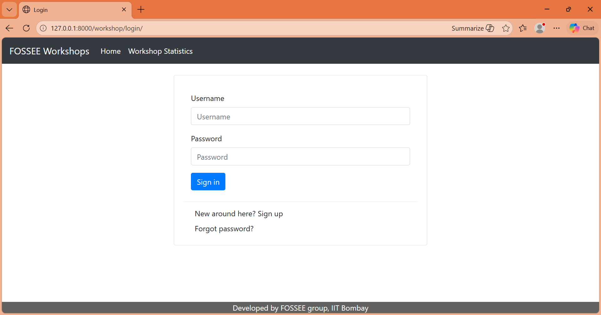
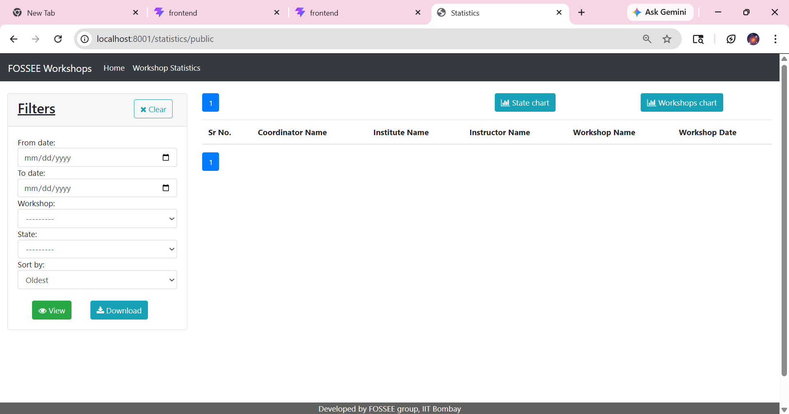
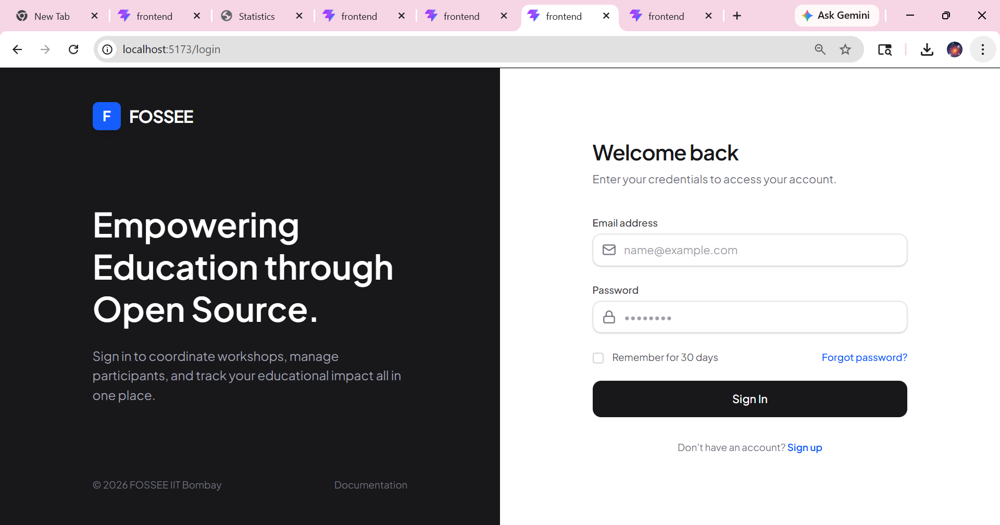
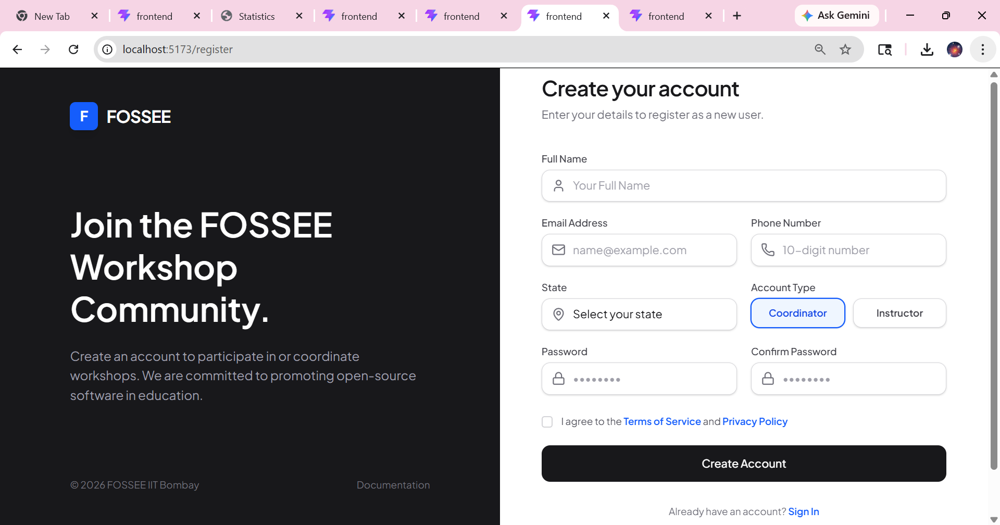
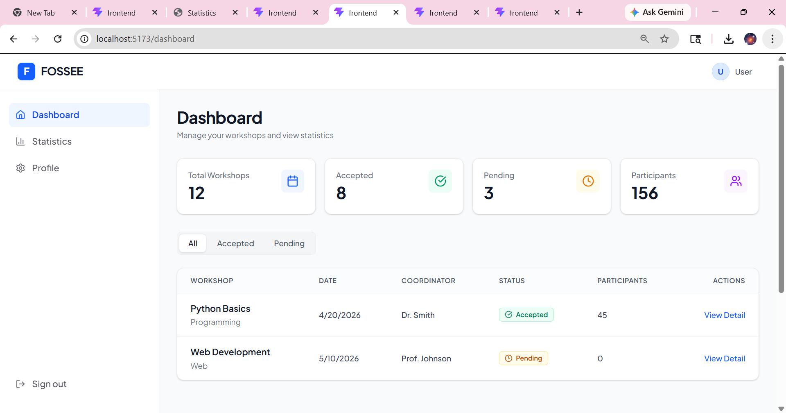
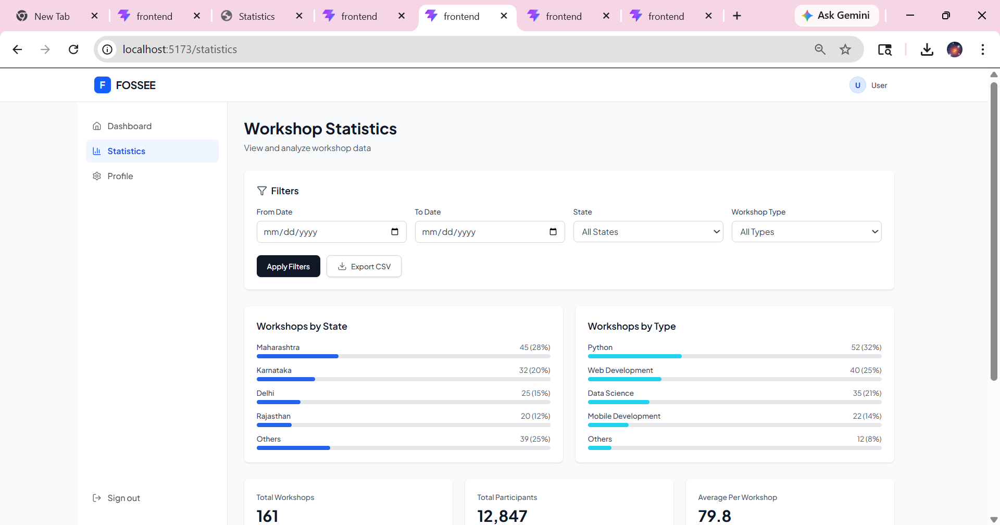
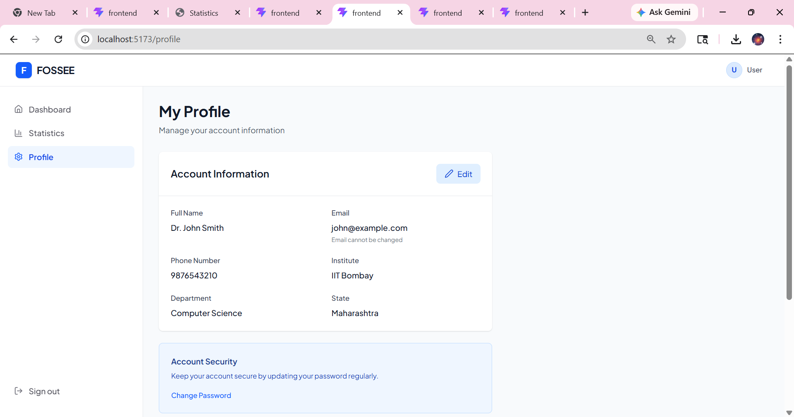

# FOSSEE Workshop Booking - UI/UX React Redesign

This repository contains the completed **UI/UX Enhancement** task for the FOSSEE Python Screening. The primary objective was to refactor and modernize the existing interface into an accessible, high-performance, developer-grade React application using Vite and Tailwind CSS.

---

## 🚀 Getting Started (Setup Instructions)

### Prerequisites
- Node.js (v18 or higher)
- Python 3.8+ (for backend)

### Running the Frontend
1. Navigate to the frontend directory:
   ```bash
   cd frontend
   ```
2. Install dependencies:
   ```bash
   npm install
   ```
3. Start the development server:
   ```bash
   npm run dev
   ```
4. Access the application at `http://localhost:5173`.

*Note: The frontend is built using React 19, Vite, React Router DOM, and Tailwind CSS.*

---

## 🧠 Reasoning & Architecture Decisions

**1. What design principles guided your improvements?**
- **Clarity and Visual Hierarchy:** Transitioned from a noisy, gradient-heavy prototype to a clean, "developer-grade" interface (white backgrounds, subtle `border-gray-200` lines, and `shadow-sm`).
- **Separation of Concerns (Navigation):** Moved primary application navigation to a dedicated persistent sidebar, restricting the top header to global actions (branding and user profile) to reduce cognitive load.
- **Micro-interactions:** Added tactile click and focus states to inputs and buttons (e.g., custom blue focus rings, segmented control boxes instead of native radio dots) to make forms feel snappy and responsive.

**2. How did you ensure responsiveness across devices?**
- **Mobile-First Grids:** Utilized Tailwind's robust responsive prefixes (`sm:`, `md:`, `lg:`). The dashboard statistics and forms drop into a single-column layout on mobile, automatically shifting to multi-column splits on larger viewports.
- **Adaptive Navigation:** The desktop sidebar navigation automatically collapses into a touch-friendly overflow hamburger menu on smaller screens, ensuring horizontal space is never compromised.
- **Scrollable Tables:** Data tables were wrapped in `overflow-x-auto` containers with reduced padding on mobile to prevent layout breaking.

**3. What trade-offs did you make between the design and performance?**
- **Native vs. Library Implementations:** To minimize the JavaScript bundle size, I implemented features like the CSV Export using native browser Blob APIs (`URL.createObjectURL`) rather than relying on heavy third-party libraries.
- **CSS-Native Animations:** Instead of using JavaScript-based animation libraries (like Framer Motion), all transitions and hover effects were implemented purely through CSS (`transition-all duration-200`, `animate-in`), directly offloading work to the GPU and preventing main-thread blocking.

**4. What was the most challenging part of the task and how did you approach it?**
- **Managing Legacy CSS Conflicts:** During the initial migration, a legacy global CSS reset (`* { padding: 0 }`) severely conflicted with the modern Tailwind Preflight setup, causing critical form inputs and buttons to squish completely and break accessibility. 
- **Approach:** I systematically isolated the conflicting stylesheet rules, removed the global overwrite natively, and relied entirely on Tailwind's Preflight engine as the single source of truth. I then restyled all input fields with explicit padding and focus-within states to guarantee predictable rendering across browsers.

---

## 📸 Visual Showcase

### Before Redesign
*(Original Django Templates)*
- 
- 

### After Redesign
*(Modernized React/Tailwind Interface)*
- 
- 
- 
- 
- 

---

<details>
<summary>Original Project Overview</summary>

> This website is for coordinators to book a workshop(s), they can book a workshop based on instructors posts or can propose a workshop date based on their convenience.

### Features
* Statistics
    1. Instructors Only
        * Monthly Workshop Count
        * Instructor/Coordinator Profile stats
        * Upcoming Workshops
        * View/Post comments on Coordinator's Profile
    2. Open to All
        * Workshops taken over Map of India
        * Pie chart based on Total Workshops taken to Type of Workshops.

* Workshop Related Features
    > Instructors can Accept, Reject or Delete workshops based on their preference, also they can postpone a workshop based on coordinators request.

__NOTE__: Check docs/Getting_Started.md for more info.
</details>
